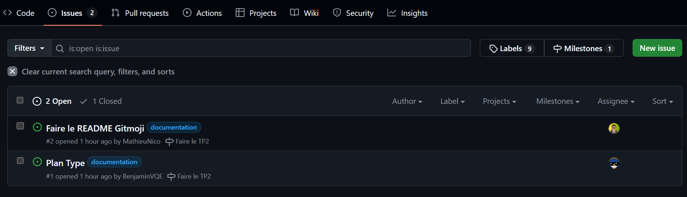

# 
SOMMAIRE

- [GITMOJI](gitmoji/gitmoji.md)
- [GITFLOW](git_flow/git_flow.md)

## Description de l'organisation

- ### Branches

  Il existe 3 branches GitFlow, Gitmoji et Plan Type afin de répartire le travaille entre les 3 personnes.

- ### Issues

  Pour vérifier l'avancement de chacuns, des issues ont été créée

  Aperçu :

- 
